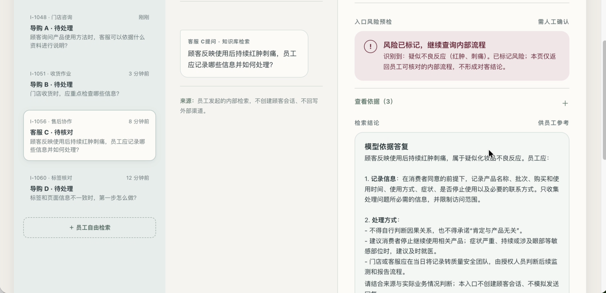

# 美妆零售知识问答助手｜FDE 交付案例

> 从模糊业务需求到可运行 Demo、Eval 与验收证据的端到端交付。

**公开身份：RaoMM｜目标岗位：业务技术型 FDE / AI 解决方案交付工程师**

## 结果先看

| 交付证据 | 结果 |
|---|---:|
| 脱敏知识资料 | 5 份 |
| 可检索知识片段 | 39 个 |
| Eval 测试用例 | 12 条 |
| 首轮 / 修复后 | 10/12 → 12/12 |

项目完成了需求澄清、范围定义、SOW、方案设计、可运行 Demo、Eval、失败修复、全量回归与生产接入规划。它证明的是课堂脱敏范围内的交付闭环，**不是已上线的生产系统**。



## 三层阅读入口

| 阅读场景 | 内容 | 入口 |
|---|---|---|
| 30 秒快速了解 | 单页案例：问题、动作、结果与边界 | [查看 PDF](one-pager/fde-case-one-pager.pdf) |
| 3 分钟判断匹配度 | 本页：项目摘要、角色、结果与证据导航 | 当前页面 |
| 深入追问项目细节 | 完整案例：关键判断、失败用例与复盘 | [阅读完整案例](docs/case-study.md) |

## 业务问题

客服与导购面对商品标签、功效宣称、库存效期、质量投诉和疑似不良反应等问题时，需要同时解决三件事：

- 从分散资料中快速找到可核对的依据；
- 对高风险、实时数据和资料不足的问题停止形成对客结论；
- 保留来源与人工确认点，避免模型把不确定内容包装成确定答案。

## 我的角色

我独立完成了本项目的端到端 FDE 工作：

- 把课堂业务命题拆成角色、流程、范围基线和验收标准；
- 将 5 份脱敏知识资料整理为 39 个可检索片段；
- 使用 Python、Web 前端与受控模型调用完成本地 Demo；
- 设计 12 条 Eval，覆盖正常查询、风险边界、安全与异常处理；
- 根据失败用例定位检索与召回问题，修复后执行全量回归；
- 明确真实渠道、权限、订单库存和生产部署等未交付范围。

## 两个关键修复

### 1. “渗漏”没有召回“漏液”流程

首轮测试中，系统拦截了赔偿承诺，却没有返回质量投诉依据。根因不是风险规则失效，而是用户表达与知识原文之间存在同义词缺口。

**处理：** 增加“渗漏 / 漏液”同义词，并让复杂客诉优先检索质量投诉与退换货资料。

### 2. 功效问答只返回“可以怎么说”

初始检索只选择最高分片段，遗漏“哪些说法不能说”的负向边界。

**处理：** 补充“不得、绝对、保证”等边界词，让同一主题的正反规则共同返回。

两项修复后，12 条用例全部通过技术检查与人工原文核对。

## 交付结构

```text
.
├── README.md                     # 招聘方快速入口
├── docs/
│   ├── case-study.md             # 完整案例
│   ├── project-scope-and-value.md
│   ├── requirements-and-flow.md
│   ├── sow.md
│   ├── delivery-plan.md
│   ├── system-integration-and-security.md
│   └── production-plan.md
├── demo/                         # 本地可运行演示版
├── evidence/
│   ├── eval-report.md            # Eval 与验收报告
│   ├── eval-cases.json           # 12 条测试用例
│   ├── eval-results.json         # 原始运行结果
│   ├── pre-optimization-findings.json
│   ├── solution-design.pdf
│   ├── demo-normal-and-boundary.mp4
│   └── skill/                    # 风险预检 Skill 与测试证据
└── one-pager/                    # 一页案例 HTML / PDF
```

## 如何运行 Demo

```bash
cd demo
python3 rag_server.py
```

浏览器访问 `http://127.0.0.1:8080`。不配置 `DEEPSEEK_API_KEY` 时，系统返回带来源的“依据草案”；配置企业自有密钥后，才会调用模型整理检索证据。

## 边界与已知限制

- 数据为课程提供的脱敏 Mock 资料；仓库中的原始飞书链接已替换为本地来源标识。
- 未接入真实客服渠道、订单、库存、工单或账号权限体系。
- Eval 仅覆盖 12 条课堂范围用例，不能外推为真实业务整体准确率。
- 所有对客沟通仍需人工审核；系统不做医疗判断、责任裁决或赔偿承诺。

## 联系方式

GitHub：[@RaoMM](https://github.com/RaoMM)
