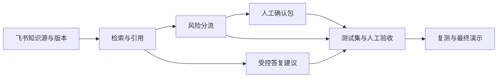

# Day 2｜需求拆解与排期文档

## 1. 任务拆解

| 编号 | 任务 | 优先级 | 依赖 | 完成标准 | 截止 |
|---|---|---|---|---|---|
| T-01 | 锁定知识源与版本元数据 | P0 | 飞书只读权限 | 5 篇资料的标题、版本、生效日期、链接可被读取和展示。 | Day 2 |
| T-02 | 完成 SOW 与范围基线 | P0 | Day 1 需求清单、T-01 | 目标、范围内外、责任、依赖、风险、验收、变更规则齐全。 | Day 2 |
| T-03 | 跑通最小技术验证 | P0 | T-01 | 可用命令读取飞书知识文档，并输出结构化来源清单；保留运行证据。 | Day 2 |
| T-04 | 设计检索与引用输出 | P0 | T-01 | 每次查询的结果结构可包含答案/资料不足、文档名、章节位置和摘录。 | Day 3 |
| T-05 | 实现风险分流规则 | P0 | T-04、Day 1 FR-04 | 对敏感肤质、不良反应、复杂客诉、规则冲突、资料不足给出人工确认原因。 | Day 4 |
| T-06 | 设计受控答复建议与人工确认包 | P1 | T-04、T-05 | 低风险场景有待审核答复；高风险场景有交接信息包。 | Day 4 |
| T-07 | 编制测试集并人工评测 | P0 | T-04、T-05 | 覆盖五类场景；逐题记录预期/实际/引用/人工判定。 | Day 5 |
| T-08 | 修正失败项并复测 | P0 | T-07 | 红线失败有归因、修正和复测记录。 | Day 5 |
| T-09 | 最终演示与范围复核 | P0 | T-02 至 T-08 | 可演示核心链路；交付物与 SOW 一致；未实现项明确列出。 | Day 6 |

## 2. Day 2–6 里程碑与时间安排

| 天数 | 当日目标 | 可交付证据 | 学习重点 |
|---|---|---|---|
| Day 2 | 定义可验收范围，证明能读到真实知识源 | SOW、排期、来源清单运行结果 | SOW 是范围与验收承诺，不是功能愿望清单。 |
| Day 3 | 让检索结果可追溯 | 查询结果包含文档、章节、摘录或“资料不足” | RAG 的第一步不是生成，而是先找对且能回看的依据。 |
| Day 4 | 让系统知道何时停下交给人 | 风险分流结果与人工确认包 | Agent 的价值也包括拒绝越界；转人工是业务流程的一环。 |
| Day 5 | 用测试集证明结果可靠 | 测试记录、人工判定、失败归因与复测 | AI 验收需要预期答案和人工判断，不能只凭单次演示。 |
| Day 6 | 用一条核心链路完成演示 | 演示记录、验收结论、范围复核 | Demo 是最短验收证据链，不等于完整上线系统。 |

## 3. 模块依赖关系

## 4. 最小技术验证说明

原型只验证两件事：

1. 能通过飞书 CLI 读取 5 篇指定知识文档的最新正文与元数据。
2. 能以一个内部咨询文本为输入，返回候选文档、命中的章节和原文摘录；该输出是“检索候选”，不是最终客服话术。

这一步的学习意义：先验证最薄的技术依赖链——身份权限、数据读取、结构化输出——再谈模型、页面和复杂工作流。否则很容易先设计了完整 Agent，最后才发现没有稳定的知识输入或引用能力。

运行方式见 `day2-最小技术验证原型/README.md`。该原型不会写入、移动或修改飞书文档。
