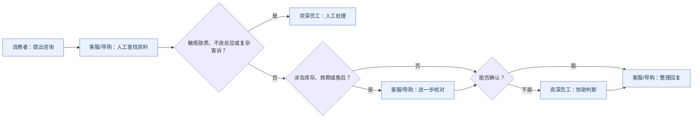
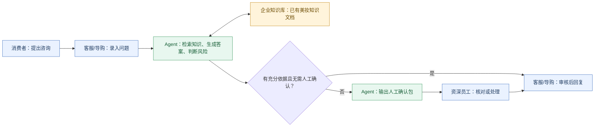

# Day 1｜美妆零售知识库与客服协作

## 需求说明清单

### 1. 项目目标

为美妆零售企业的客服与导购提供一期知识检索与问答辅助能力。面对产品选择、成分功效、适用肤质、使用方法、库存效期、退换货和不良反应等咨询，工具应基于已有美妆知识文档给出有依据的答案，并明确哪些情况必须由人工确认。

一期交付的核心闭环是：问题录入 → 知识检索 → 有依据的答案和人工确认标记 → 人工审核或处理。

### 2. 客户与使用者

| 对象 | 在本项目中的角色与诉求 |
|---|---|
| 项目客户 | 美妆零售企业，需要减少一线查询与核对时间，统一回答依据，降低功效表述越界和高风险问题漏转人工的风险。 |
| 直接使用者 | 客服、导购，需要快速获得可追溯的答复建议。 |
| 人工确认者 | 资深员工，负责处理无法确认、敏感肤质、不良反应和复杂客诉等事项。 |
| 最终服务对象 | 提出咨询的消费者。 |

### 3. 当前业务问题

当前流程中，客服或导购收到问题后，人工查找商品资料和服务资料；涉及库存、效期或售后规则时再进一步核对；无法确认时咨询资深员工，再整理回复。敏感肤质、不良反应和复杂客诉转由人工处理。

由此产生的主要问题是：

1. 商品资料、服务规范和个人经验分散，版本可能不一致。
2. 查找和核对耗时，新员工难以稳定复用资深员工的判断。
3. 功效描述容易越界，高风险问题可能未被及时转人工。
4. 回答缺少可核查的依据，难以判断其可靠性。

### 4. 功能需求

| 编号 | 功能 | 需求说明 |
|---|---|---|
| FR-01 | 问题接收与分类 | 支持商品信息、成分功效、库存效期、退换货、不良反应五类咨询的检索与问答。 |
| FR-02 | 知识检索 | 仅基于已有美妆知识文档检索相关内容，不以未确认信息补全答案。 |
| FR-03 | 有依据的答案 | 每次输出至少包含用户问题、实际答案、引用的知识文档及原文位置。 |
| FR-04 | 人工确认判断 | 对信息缺失、规则冲突、敏感肤质、不良反应和复杂客诉，输出“需要人工确认”及触发原因。 |
| FR-05 | 人工确认包 | 需转人工时，提供用户问题、已命中的知识依据、触发原因和待核对信息，便于资深员工接手。 |
| FR-06 | 测试支持 | 支持构建和使用包含“知识库问题、预期答案、实际答案”的测试题集，覆盖五类咨询场景，由人工逐题判断结果。 |

### 5. 非功能需求与业务约束

| 维度 | 要求 |
|---|---|
| 可追溯性 | 每个实际答案都应显示引用的知识文档和原文位置。 |
| 准确与边界 | 不编造商品信息，不作医疗诊断，不作绝对功效承诺。 |
| 风险控制 | 信息缺失、规则冲突、敏感肤质、不良反应及复杂客诉必须转人工。 |
| 数据使用 | 仅使用脱敏美妆知识文档和模拟数据，不使用真实客户隐私。 |
| 知识保护 | 工具不得自动修改原始知识文档。 |

### 6. 本期范围

本期仅交付面向客服与导购的内部辅助闭环：基于已有知识文档完成检索，输出有依据的答案，并标记是否需要人工确认。测试题集用于人工验收答案与风险判断。

### 7. 本期不做什么

1. 不作医疗诊断、治疗建议、不良反应因果判断，或绝对功效与安全承诺。
2. 不自动向消费者发送回复，客服或导购保留对外沟通与最终审核责任。
3. 不自动批准退换货、赔付或处理复杂客诉。
4. 不自动修改原始知识文档。
5. 不接入未经确认的数据来源来判断实时库存、效期、订单或最终售后结论；此类问题信息不足时转人工核对。

### 8. 待确认问题

| 待确认事项 | 对本期或后续的影响 |
|---|---|
| 库存、效期和售后规则进一步核对时，应以哪些业务资料为准？ | 决定人工确认包中应补充什么信息，以及后续是否具备系统对接条件。 |
| 高风险问题转人工后，由哪类资深员工接手？ | 决定实际交接路径，不在本期假定具体组织或岗位。 |
| 已有知识文档的版本确认、审核和更新由谁负责？ | 决定引用依据的有效性与后续知识维护方式。 |
| 测试题集的预期答案由谁确认？ | 决定验收时“实际答案与预期答案一致”的判断依据。 |

### 9. 项目假设

1. 本期提供的美妆知识文档可作为测试和检索的输入材料；其业务有效版本需由企业确认。
2. 客服、导购与资深员工继续承担人工审核、人工确认和对外沟通职责。
3. 对未能从知识文档确认的问题，工具可以提示信息不足，但不补造答案。

### 10. 初步业务指标与验收口径

| 指标 | 计算或判断方式 |
|---|---|
| 场景覆盖度 | 测试题集覆盖商品信息、成分功效、库存效期、退换货、不良反应五类场景。 |
| 答案一致性 | 人工逐题判断实际答案是否与预期答案一致。 |
| 引用完整性 | 人工抽查实际答案是否同时包含引用文档和原文位置。 |
| 人工确认判断正确性 | 人工抽查高风险、信息缺失和规则冲突问题是否被正确标记为需要人工确认。 |

具体阈值由企业结合业务风险确定。本期不可突破的红线是：不编造、不越界、不漏转命题规定的高风险情形。

### 11. 后续延伸，不纳入本期范围

对反复出现、现有知识未覆盖的问题，可由资深员工形成候选补充内容，经人工审核后再更新知识库。该闭环用于复用经验，但不允许 Agent 自动写回原始知识文档。

## 业务流程图

图例：蓝色为人，绿色为 Agent，黄色为企业知识库或业务资料。

### 现状流程 AS-IS

问题集中在三处：资料与经验分散导致查找和核对耗时；无法确认时依赖资深员工个人经验；最终回复没有稳定的引用依据，高风险问题可能漏转人工。

### 目标流程 TO-BE

分工边界：客服与导购负责录入、审核和对外回复；Agent 负责检索、基于原文形成答案、标记人工确认；企业知识库提供可引用的已有材料；资深员工负责高风险与无法确认事项的最终判断和处理。
