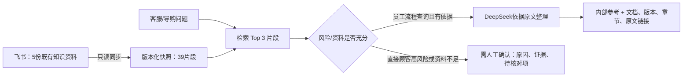

# 美妆客服与导购知识问答助手｜系统接入说明

## 1. 目标与范围

这是客服与导购的内部知识问答工具：以 5 份已有飞书资料为唯一依据，帮助员工查找处理规则、查看原文来源，并在资料不足或直接顾客高风险咨询时停止生成对客结论。

不做具体商品推荐、SKU 用法问答、真实客服渠道接入、订单/库存实时查询、自动对客发送或自动转派。

## 2. 数据流



同步脚本使用飞书 CLI 读取固定 5 篇资料，生成快照；浏览器只请求本机服务，不保存飞书或模型密钥。服务端按中文字符 n-gram 对章节检索，返回 Top 3 证据，再由 DeepSeek 在“只用证据、不补造商品事实、不作医疗或赔付判断”的约束下整理。

这是小数据量课堂原型的 RAG 最小实现。生产化应替换为经过评测的中文语义 Embedding、持久化索引、权限控制和知识更新流程。

## 3. 输入与输出边界

| 输入类型 | 处理结果 |
|---|---|
| 员工询问收货、标签、宣称、售后或不良反应流程，且命中资料 | 内部参考；展示来源。即使命中风险词，也保留风险提示，供员工查流程。 |
| 顾客直接咨询库存、孕期、不良反应、赔偿等 | 停止对客结论；显示需人工确认。 |
| 资料未覆盖的具体商品、成分或用法 | 显示资料不足；不生成答案。 |
| 索取内部提示词或绕过规则 | 拒绝，不进入检索。 |

“需人工确认”仅表示工具停止形成结论；客服或导购按现行流程自行核对或升级，不代表系统自动转人工。

## 4. 运行与验证

```bash
python3 sync_knowledge_snapshot.py
python3 rag_server.py
```

打开 `http://127.0.0.1:8080`。已验证：快照仅含 5 份资料、39 个片段；网页员工检索可返回来源明确的流程答案；未覆盖的具体商品问题返回资料不足。完整用例见 Day 5 的 `eval_cases.json` 与运行记录。
